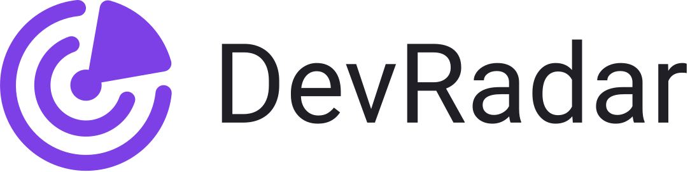

<h1 align="center">
    
</h1>

<h4 align="center"> 🛰 Aplicação desenvolvida na Semana Omnistack 10.0</h4>

## 🚀 Tecnologias
As seguintes tecnologias foram utilizadas:

- ⚛️ **React Js**
- ⚛️ **React Native**
- 💹 **Node Js**
- 📚 **Expo**

## 🧐 Sobre
O DevRadar é um projeto que visa conectar desenvolvedores que estão próximos e que utilizam as mesmas tecnologias.

## 💭 Como Funciona
Primeiramente, o usuário irá cadastrar dentro da aplicação web algumas informações úteis, para facilitar na busca por desenvolvedores.

Utilizando a aplicação mobile o usuário conseguirá visualizar dentro do mapa os programadores que estão próximos, podendo acessar o perfil do Github do mesmo.

## 🎥 Demonstração

  

## 📝 Licença
Esse projeto está sob a licença MIT. Veja o arquivo [LICENSE](LICENSE.md) para mais detalhes.
